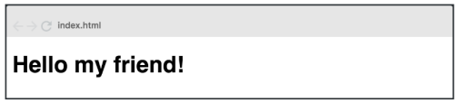

# Trabajo Práctico de React
## Ejercicio 2 - Hello My Friend!

Modificar el componente anterior y enviar mediante props el valor “My friend” de
manera que el mensaje quede de la siguiente forma:

## Repositorio GitHub

## Deploy

## Autor

**Mendoza, Mariana Eugenia** 😃

## Herramientas Utilizadas 🛠️

- HTML
- CSS 
- Bootstrap 5.3.3
- JavaScript
- GIT y GitHub
- React
